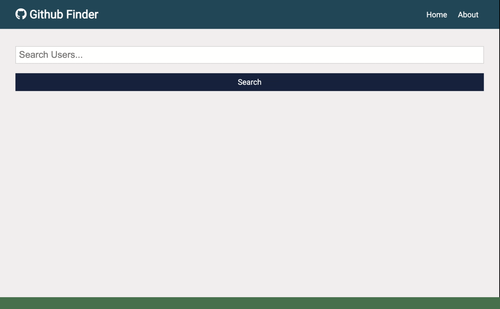

<!-- PROJECT LOGO -->
 

  

  <h3 align="center">GitHub Finder</h3>

  

    React application to search for GitHub users.
     
     
    <a href="https://github-finder-flame.vercel.app/">View Demo</a>
    ·
    <a href="https://github.com/Pete-Sekesan/github-finder/issues">Report Bug</a>
    ·
    <a href="https://github.com/Pete-Sekesan/github-finder/issues">Request Feature</a>
  

<!-- ABOUT THE PROJECT -->

## About The Project

Utilizing the GitHub API, this application lets you search for a name or username of any GitHub user and then presents you with a streamlined user bio page along with their most recent five projects. This application was originally written using class components, which I then refactored to functional via React Hooks.

### Built With

- [HTML](https://developer.mozilla.org/en-US/docs/Web/HTML)
- [CSS](https://developer.mozilla.org/en-US/docs/Web/CSS)
- [JavaScript](https://www.javascript.com/)
- [React](https://reactjs.org/)

<!-- USAGE EXAMPLES -->

## Usage

Use this app to search for specific users or even portion of user names from GitHub. The results will then give you a streamlined interface to see recent work and some highlighted information including recent repos, if they are looking for work, etc. If more information is needed, a link to their full user profile is available.

<!-- ROADMAP -->

## Roadmap

See the [open issues](https://github.com/Pete-Sekesan/github-finder/issues) for a list of proposed features (and known issues).

## Contact

Twitter - [@PeterSekesan](https://twitter.com/PeterSekesan)  
psekesan@gmail.com

Portfolio: https://peter-sekesan.dev

Project Link: [https://github.com/Pete-Sekesan/github-finder](https://github.com/Pete-Sekesan/github-finder)

<!-- GETTING STARTED -->

## Getting Started

This project was bootstrapped with [Create React App](https://github.com/facebook/create-react-app).

## Available Scripts

In the project directory, you can run:

### `npm start`

Runs the app in the development mode.\
Open [http://localhost:3000](http://localhost:3000) to view it in the browser.

The page will reload if you make edits.\
You will also see any lint errors in the console.

### `npm test`

Launches the test runner in the interactive watch mode.\
See the section about [running tests](https://facebook.github.io/create-react-app/docs/running-tests) for more information.

### `npm run build`

Builds the app for production to the `build` folder.\
It correctly bundles React in production mode and optimizes the build for the best performance.

The build is minified and the filenames include the hashes.\
Your app is ready to be deployed!

See the section about [deployment](https://facebook.github.io/create-react-app/docs/deployment) for more information.

### `npm run eject`

**Note: this is a one-way operation. Once you `eject`, you can’t go back!**

If you aren’t satisfied with the build tool and configuration choices, you can `eject` at any time. This command will remove the single build dependency from your project.

Instead, it will copy all the configuration files and the transitive dependencies (webpack, Babel, ESLint, etc) right into your project so you have full control over them. All of the commands except `eject` will still work, but they will point to the copied scripts so you can tweak them. At this point you’re on your own.

You don’t have to ever use `eject`. The curated feature set is suitable for small and middle deployments, and you shouldn’t feel obligated to use this feature. However we understand that this tool wouldn’t be useful if you couldn’t customize it when you are ready for it.
